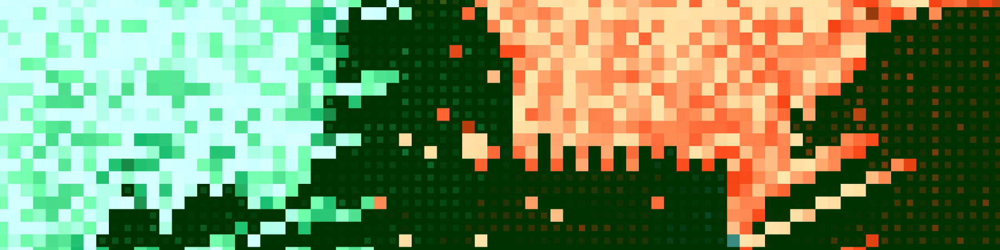

# Lorem ipsum, hello world

Hi. I'm Denis he/him dev and designer with a passion for creating beautiful, intuitive digital experiences. I also dabble in creative design, bringing a unique perspective and style to my work.

# Skills

- Frontend Developement (SCSS, React, NextJS, TypeScript, Ethers, Viem, Wagmi, motion, tailwind)
- UX/UI Design (Wireframing, Prototyping, User Research)
- Creative Design (Mixed Media Artwork, Graphic Design, Illustration, Animation, Logotypes, Complete Branding)

# Experience

I've been working in the industry for 10+ years, honing my skills and working on a variety of projects for clients big and small. I'm always looking for new challenges and opportunities to learn and grow.

# Contact

Want to get in touch? Feel free to [yo@shutock.com](mailto:yo@shutock.com) or [https://shutock.t.me](shutock.t.me). I'm always happy to chat about design, development, and everything in between.

  
  
  
  
  

